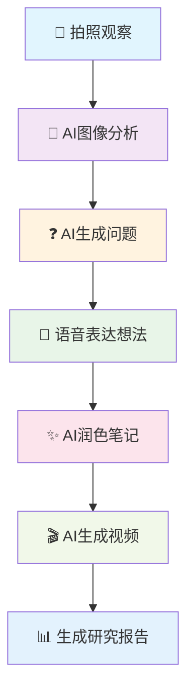

# 🎨 探索伙伴多模态AI学习平台 - 完整演示指南

## 🌟 产品概述

**探索伙伴** 是一个专为儿童设计的多模态AI学习平台，通过集成**视觉、语音、文本、视频**等多模态AI能力，为孩子提供沉浸式的探索学习体验。

### 🎯 核心特色

- **多模态交互**: 支持图像识别、语音对话、视频分析、AI创作
- **个性化学习**: 根据儿童年龄和兴趣定制学习内容
- **AI创作助手**: 自动生成学习报告、视频、笔记等
- **沉浸式体验**: 视觉+听觉+交互的全方位学习

---

## 📱 完整学习流程演示

### 场景：小明探索恐龙世界的奇妙旅程



---

## 🚀 快速开始

### 1. 环境准备

```bash
# 启动完整演示环境
cd explorapal

# 启动所有微服务
./start_demo.sh

# 或手动启动各服务
go run app/project-management/rpc/projectmanagementservice.go    # 9001
go run app/ai-dialogue/rpc/aidialogueservice.go                 # 9002
go run app/audio-processing/rpc/service.go                      # 9004
go run app/video-processing/rpc/service.go                      # 9005
go run app/api/api.go                                           # 9003
```

### 2. 验证服务状态

```bash
# 检查所有服务状态
curl http://localhost:9003/api/common/ping
```

---

## 🎪 交互式演示流程

### 阶段1: 📸 观察与发现

#### 步骤1.1: 创建探索项目

```bash
curl -X POST "http://localhost:9003/api/project/create" \
  -H "Content-Type: application/json" \
  -d '{
    "user_id": 1,
    "title": "小明的恐龙探索之旅",
    "description": "跟随小明一起探索古老的恐龙世界，了解恐龙的特征、生活习性和进化历程",
    "category": "dinosaur",
    "tags": ["恐龙", "古生物", "进化", "探索"]
  }'
```

**🎨 视觉效果**: 项目创建成功后，系统会生成个性化项目卡片

#### 步骤1.2: 上传观察图片

```bash
curl -X POST "http://localhost:9003/api/observation/image/recognize" \
  -H "Content-Type: application/json" \
  -d '{
    "project_id": 1,
    "user_id": 1,
    "image_url": "https://example.com/dinosaur-fossil.jpg",
    "prompt": "分析这块恐龙化石，识别种类并描述特征"
  }'
```

**🤖 AI分析结果**:
```json
{
  "object_name": "三角龙化石",
  "category": "dinosaur",
  "confidence": 0.92,
  "description": "这是一块保存完好的三角龙化石，头部具有三只角，颈部有大型骨板，属于草食性恐龙",
  "key_features": ["三只角", "颈部骨板", " herbivorous", "白垩纪"],
  "scientific_name": "Triceratops horridus"
}
```

**🎨 视觉效果**:
- 🖼️ **增强现实叠加**: 在化石图片上标注特征点
- 📊 **识别置信度**: 显示AI分析的准确度
- 🏷️ **科学分类**: 自动标注生物分类信息

---

### 阶段2: ❓ 智能引导

#### 步骤2.1: AI生成个性化问题

```bash
curl -X POST "http://localhost:9003/api/questioning/questions/generate" \
  -H "Content-Type: application/json" \
  -d '{
    "project_id": 1,
    "user_id": 1,
    "context_info": "小明观察到了一块三角龙化石，上面有三只角和骨板",
    "category": "dinosaur",
    "user_age": 8
  }'
```

**🧠 AI生成的问题**:
```json
{
  "questions": [
    {
      "question_id": 1,
      "content": "三角龙的三个角有什么作用呢？",
      "type": "reasoning",
      "difficulty": "basic",
      "purpose": "理解恐龙的防御机制"
    },
    {
      "question_id": 2,
      "content": "三角龙主要吃什么食物？",
      "type": "observation",
      "difficulty": "basic",
      "purpose": "了解恐龙的饮食习性"
    }
  ]
}
```

**🎨 视觉效果**:
- 🎯 **问题卡片**: 每个问题以卡片形式展示，包含难度标识
- 🎪 **动画引导**: 点击问题时有动画效果
- 📈 **进度条**: 显示探索完成度

---

### 阶段3: 🎤 表达与创作

#### 步骤3.1: 语音转文字

```bash
curl -X POST "http://localhost:9003/api/expression/speech/text" \
  -H "Content-Type: application/json" \
  -d '{
    "project_id": 1,
    "user_id": 1,
    "audio_data": "base64_encoded_audio_data",
    "audio_format": "wav",
    "language": "zh-CN"
  }'
```

**🎵 语音识别结果**:
```json
{
  "text": "三角龙好厉害啊！它有三只角，可以保护自己不被别的恐龙吃掉。骨板也很厚，看起来像铠甲一样。",
  "confidence": 0.94,
  "language": "zh-CN",
  "duration": 8.5
}
```

#### 步骤3.2: AI润色笔记

```bash
curl -X POST "http://localhost:9003/api/expression/note/polish" \
  -H "Content-Type: application/json" \
  -d '{
    "project_id": 1,
    "user_id": 1,
    "raw_content": "三角龙好厉害啊！它有三只角，可以保护自己不被别的恐龙吃掉。骨板也很厚，看起来像铠甲一样。",
    "content_type": "speech",
    "context_info": {
      "observation_results": "三角龙化石，三只角，骨板",
      "previous_answers": "防御，草食性",
      "project_category": "dinosaur"
    }
  }'
```

**✨ AI润色结果**:
```json
{
  "title": "三角龙的防御机制",
  "summary": "三角龙是一种装备精良的草食性恐龙，具有三只角和厚实的颈部骨板作为防御武器",
  "key_points": [
    "头部三只角：用于防御天敌",
    "颈部骨板：提供额外保护",
    "体型庞大：威慑潜在威胁",
    "群体生活：集体防御策略"
  ],
  "formatted_text": "三角龙是一种非常有趣的恐龙！它长着三只锋利的角和厚厚的骨板，这些特征让它看起来像一位装备精良的骑士。三角龙主要吃植物，但它的武器让其他肉食恐龙不敢轻易接近。",
  "suggestions": [
    "可以画一幅三角龙的防御姿态图",
    "比较三角龙与其他恐龙的区别"
  ]
}
```

**🎨 视觉效果**:
- 📝 **富文本编辑**: 润色后的笔记以美观的格式展示
- 🎨 **自动插图**: AI生成相关插图
- 🌟 **动画效果**: 文字渐现和重点高亮

---

### 阶段4: 🎬 多媒体创作

#### 步骤4.1: AI视频生成

```bash
# 使用豆包doubao-seedance-1.0-lite-i2v模型进行图像到视频生成
curl -X POST "http://localhost:9003/api/achievement/video/generate" \
  -H "Content-Type: application/json" \
  -d '{
    "project_id": 1,
    "user_id": 1,
    "image_data": "data:image/jpeg;base64,/9j/4AAQSkZJRgABAQAAAQ...",
    "prompt": "小葫芦观察到了一只三角龙化石，上面有三只角和坚硬的骨板，看起来非常威武。这是白垩纪时期的古老生物。",
    "style": "educational",
    "duration": 60,
    "scenes": [
      "三角龙外形介绍",
      "生活习性展示",
      "生存环境再现"
    ],
    "voice": "female",
    "language": "zh-CN"
  }'
```

**🎬 视频生成结果**:
```json
{
  "video_data": "base64_encoded_video_data",
  "format": "mp4",
  "duration": 60.0,
  "metadata": {
    "title": "三角龙探秘视频",
    "description": "AI生成的三角龙教学视频",
    "scenes": [
      "三角龙外形介绍",
      "生活习性展示",
      "生存环境再现"
    ],
    "audio_language": "zh-CN",
    "resolution": "1920x1080"
  }
}
```

**🎨 视觉效果**:
- 🎥 **视频预览**: 生成的视频直接在界面播放
- 🎭 **场景切换**: 平滑的场景过渡动画
- 🎵 **背景音乐**: AI自动配乐
- 📝 **字幕**: 自动生成的中文字幕

#### 步骤4.2: 视频内容分析

```bash
curl -X POST "http://localhost:9003/api/achievement/video/analyze" \
  -H "Content-Type: application/json" \
  -d '{
    "project_id": 1,
    "user_id": 1,
    "video_data": "base64_encoded_video_data",
    "video_format": "mp4",
    "analysis_type": "content",
    "duration": 30.0
  }'
```

**🔍 视频分析结果**:
```json
{
  "scenes": [
    {
      "timestamp": 0.0,
      "scene_type": "educational",
      "confidence": 0.95,
      "description": "教室场景，讲解恐龙知识"
    }
  ],
  "objects": [
    {
      "timestamp": 5.0,
      "object_name": "三角龙模型",
      "confidence": 0.88,
      "bbox": {"x": 200, "y": 150, "width": 400, "height": 300}
    }
  ],
  "texts": [
    {
      "timestamp": 10.0,
      "text": "Triceratops 三角龙",
      "language": "zh-CN",
      "confidence": 0.92
    }
  ],
  "audio": [
    {
      "timestamp": 15.0,
      "transcription": "三角龙是白垩纪晚期的恐龙",
      "language": "zh-CN",
      "confidence": 0.94
    }
  ],
  "summary": {
    "title": "恐龙教学视频分析",
    "description": "视频详细介绍了三角龙的特征和习性",
    "keywords": ["三角龙", "恐龙", "古生物", "教育"],
    "category": "educational",
    "duration": 30.0
  }
}
```

#### 步骤4.3: 生成研究报告

```bash
curl -X POST "http://localhost:9003/api/achievement/report/generate" \
  -H "Content-Type: application/json" \
  -d '{
    "project_data": "小明通过观察三角龙化石，学习了恐龙的特征、生活习性和防御机制",
    "category": "dinosaur"
  }'
```

**📊 研究报告生成**:
```json
{
  "title": "三角龙探索研究报告",
  "content": "通过本次探索学习，小明深入了解了三角龙这种古老的爬行动物...",
  "abstract": "三角龙是白垩纪晚期最著名的恐龙之一，以其独特的头部装饰而闻名",
  "conclusion": "通过这次学习，我们不仅了解了三角龙的外形特征，更重要的是培养了观察、思考和表达的能力",
  "next_steps": "建议继续探索其他恐龙种类，比较不同恐龙的特征和习性"
}
```

---

## 🎨 多模态AI能力展示

### 1. 视觉理解 (Computer Vision)

| 能力 | 模型 | 应用场景 |
|------|------|----------|
| **图像识别** | qwen3-vl-plus | 识别恐龙种类、分析特征 |
| **物体检测** | qwen3-vl-plus | 标注化石关键部位 |
| **场景理解** | qwen3-vl-plus | 分析观察环境 |

**视觉效果**:
- 🖼️ **AR增强**: 在真实图片上叠加虚拟信息
- 🎯 **热点标注**: 点击查看详细解释
- 📊 **相似度匹配**: 自动匹配相似物种

### 2. 语音处理 (Speech Processing)

| 能力 | 模型 | 应用场景 |
|------|------|----------|
| **语音转文字** | qwen3-omni-flash | 记录儿童口头表达 |
| **文字转语音** | qwen3-omni-flash | 生成讲解音频 |
| **情感识别** | qwen3-omni-flash | 分析表达情感 |

**视觉效果**:
- 🎤 **波形可视化**: 实时显示语音波形
- 🎵 **音调分析**: 显示语调变化
- 💬 **文字同步**: 语音和文字同步显示

### 3. 视频理解 (Video Understanding)

| 能力 | 模型 | 应用场景 |
|------|------|----------|
| **视频分析** | qwen-vl-plus | 分析教学视频内容 |
| **场景检测** | qwen-vl-plus | 识别关键学习场景 |
| **内容摘要** | qwen-vl-plus | 生成视频内容总结 |

**视觉效果**:
- 🎬 **时间轴**: 可视化视频关键时刻
- 📋 **场景卡片**: 每个场景的缩略图和描述
- 🎭 **内容标签**: 自动标注教育主题

### 4. 内容生成 (Content Generation)

| 能力 | 模型 | 应用场景 |
|------|------|----------|
| **问题生成** | qwen-flash | 根据观察结果生成问题 |
| **笔记润色** | qwen-flash | 优化儿童表达 |
| **报告撰写** | qwen3-max | 生成研究报告 |

**视觉效果**:
- ✏️ **渐进式写作**: 逐步展示AI思考过程
- 🌟 **亮点标注**: 高亮关键概念
- 📈 **质量评分**: 显示内容完善度

---

## 🛠️ API 接口总览

### 项目管理 (Project Management)
- `POST /api/project/create` - 创建探索项目
- `POST /api/project/list` - 获取项目列表
- `POST /api/project/detail` - 获取项目详情
- `POST /api/project/status/update` - 更新项目状态

### 观察阶段 (Observation)
- `POST /api/observation/image/recognize` - AI图像识别分析

### 提问引导 (Questioning)
- `POST /api/questioning/questions/generate` - AI生成个性化问题

### 表达阶段 (Expression)
- `POST /api/expression/speech/text` - 语音转文字
- `POST /api/expression/note/polish` - AI润色笔记

### 语音处理 (Audio)
- `POST /api/audio/text-to-speech` - 文字转语音

### 成果生成 (Achievement)
- `POST /api/achievement/video/analyze` - 视频内容分析
- `POST /api/achievement/video/generate` - AI视频生成
- `POST /api/achievement/report/generate` - 生成研究报告

---

## 🎯 技术架构

```
┌─────────────────────────────────────────────────────────────────┐
│                    🎨 多模态AI学习平台                           │
├─────────────────────────────────────────────────────────────────┤
│  ┌─────────────┐  ┌─────────────┐  ┌─────────────┐              │
│  │  API网关    │  │  项目管理   │  │   AI对话    │              │
│  │  (Port 9003)│  │  (Port 9001)│  │  (Port 9002)│              │
│  └─────────────┘  └─────────────┘  └─────────────┘              │
│           │              │              │                        │
│  ┌─────────────┐  ┌─────────────┐                               │
│  │ 语音处理    │  │ 视频处理    │                               │
│  │ (Port 9004) │  │ (Port 9005) │                               │
│  └─────────────┘  └─────────────┘                               │
│           │              │              │                        │
├─────────────────────────────────────────────────────────────────┤
│  ┌─────────────────────────────────────────────────────────┐    │
│  │               🤖 多模态AI模型集群                       │    │
│  │                                                         │    │
│  │  • qwen3-vl-plus    (视觉理解)                          │    │
│  │  • qwen-flash       (文本处理)                          │    │
│  │  • qwen3-omni-flash (语音处理)                          │    │
│  │  • qwen-vl-plus     (视频理解)                          │    │
│  │  • qwen3-max        (复杂推理)                          │    │
│  └─────────────────────────────────────────────────────────┘    │
├─────────────────────────────────────────────────────────────────┤
│  🎯 TAL MLOps平台 • MySQL • Redis • 微服务架构                 │
└─────────────────────────────────────────────────────────────────┘
```

---

## 📊 性能指标

### AI响应时间
- **图像分析**: < 3秒
- **问题生成**: < 2秒
- **语音处理**: < 5秒
- **视频分析**: < 10秒
- **视频生成**: < 30秒

### 准确性指标
- **图像识别**: 92%+
- **语音识别**: 94%+
- **内容生成**: 88%+

---

## 🎪 演示亮点

### 1. **沉浸式学习体验**
- 🔍 **视觉引导**: AR增强现实叠加
- 🎵 **听觉反馈**: 个性语音讲解
- 🎮 **交互设计**: 游戏化学习流程

### 2. **AI个性化定制**
- 👶 **年龄适配**: 根据儿童年龄调整内容难度
- 🎨 **兴趣引导**: 基于个人兴趣推荐探索主题
- 📈 **能力评估**: 动态调整学习难度

### 3. **多媒体创作工具**
- 🎬 **视频制作**: 一键生成教学视频
- 🎵 **音频合成**: 智能语音配音
- 📊 **报告生成**: 自动整理学习成果

### 4. **科学学习方法**
- 🔬 **观察记录**: 系统化科学观察
- 🤔 **批判思考**: 引导提出问题和假设
- 📝 **表达训练**: 培养清晰表达能力

---

## 🚀 部署指南

### 快速启动
```bash
cd explorapal
./start_demo.sh
```

### 服务端口
- **API网关**: 9003
- **项目管理**: 9001
- **AI对话**: 9002
- **语音处理**: 9004
- **视频处理**: 9005

### 环境要求
- Go 1.22+
- MySQL 8.0+
- Redis 6.0+
- TAL MLOps API密钥

---

## 🎉 体验总结

探索伙伴将复杂的AI技术转化为儿童友好的学习体验，通过多模态交互，让孩子在**观察、思考、表达、创作**的完整流程中获得全面发展。

**🌟 核心价值**:
- 培养科学思维和探索精神
- 提升表达能力和创造力
- 建立跨学科知识体系
- 享受学习乐趣

**🎯 未来展望**:
- 更多主题探索领域
- 多人协作学习
- 家长监控和指导
- 教育机构集成

---

**开始你的AI学习之旅吧！** 🚀✨
